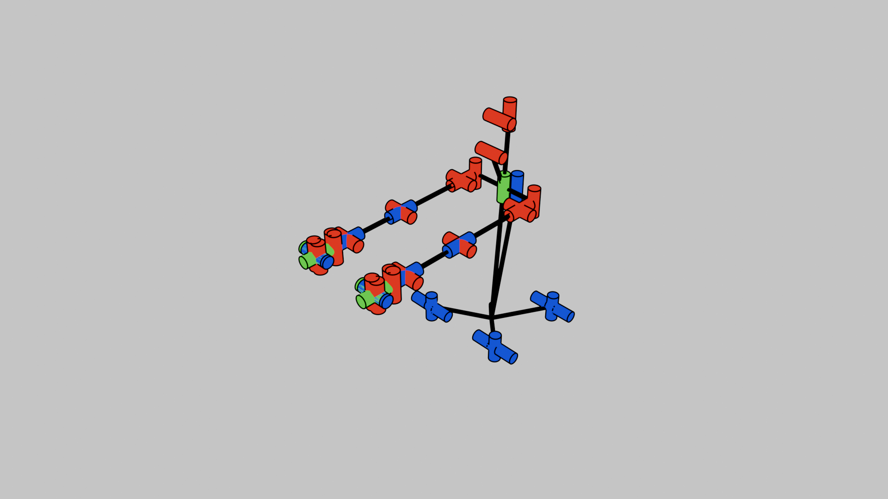

# FormaMotus - Robot Kinematics Visualization Add-on for Blender

**FormaMotus** is a Blender add-on designed to visualize robot kinematics structures within Blender. It loads robot models from URDF (Unified Robot Description Format) files, visually represents joints and links, and provides rendering capabilities.

## Features
- Load and visualize robot models from URDF files in Blender
- Customizable colors for different joint types (revolute, prismatic, continuous, etc.)
- Adjustable cylinder sizes for joint representation
- Real-time joint angle manipulation via sliders
- High-quality rendering with Freestyle line art

## Installation
1. **Download the Repository**

    [Zip Repository](https://github.com/iory/formamotus/releases/download/v1.0.0/formamotus.zip)

2. **Install the Add-on in Blender**
- Open Blender and navigate to `Edit > Preferences > Add-ons`.
- Click `Install` and select the `zip` file.
- Enable the add-on. Dependencies (`numpy`, `scikit-robot`) will be installed automatically.

3. **Restart Blender**
After installation, restart Blender to activate the add-on.

## Usage
1. **Access the Add-on Panel**
The `FormaMotus` tab appears in the 3D Viewport sidebar (press `N` to show it).

2. **Specify URDF File**
- Enter the path to your robot’s URDF file in `URDF Filepath` (defaults to `pr2_urdfpath`).
- Optionally, set the `Render Filepath` for saving the rendered image.

3. **Customize Joint Colors**
- Adjust colors for revolute, prismatic, continuous, and other joint types as needed.

4. **Adjust Cylinder Sizes**
- Use sliders to modify the radius and height of joint cylinders and connector cylinders.

5. **Visualize the Robot**
- Click `Visualize Robot` to display the robot in the 3D view based on the URDF file.
- Use sliders to adjust joint angles and see changes in real time.

6. **Render the Scene**
- Click `Render Image` to save a PNG image to the specified path.
- The camera is automatically positioned at a 45-degree angle from the right-front, with Freestyle lines added.

## Bug Reports & Feature Requests
For issues or suggestions, please submit them to [GitHub Issues](https://github.com/iory/formamotus/issues).
