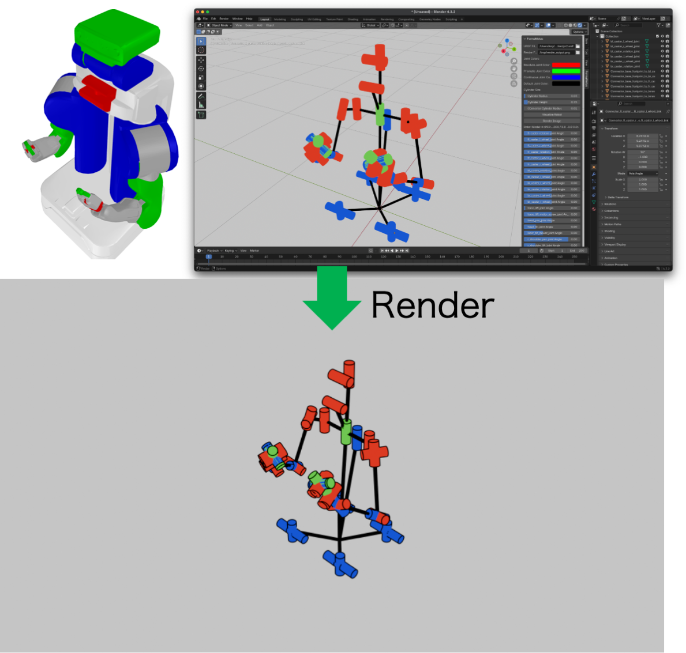

# FormaMotus - Blender用ロボットキネマティクス可視化アドオン

**FormaMotus** は、Blender内でロボットのキネマティクス構造を可視化するためのアドオンです。URDF（Unified Robot Description Format）ファイルからロボットモデルを読み込み、関節やリンクを視覚的に表現し、レンダリング機能も提供します。

## 特徴
- URDFファイルからロボットモデルを読み込み、Blender内で可視化
- 関節タイプ（回転、並進、連続など）に応じたカスタマイズ可能な色設定
- 関節シリンダーのサイズ調整
- スライダーを使ったリアルタイムな関節角度操作
- Freestyleを使った高品質な線画付きレンダリング

## インストール
1. **リポジトリをダウンロード**

    [Zip Repository](https://github.com/iory/formamotus/releases/download/v1.0.0/formamotus.zip)

2. **Blenderにアドオンをインストール**
- Blenderを開き、`Edit > Preferences > Add-ons` に移動します。
- `Install from Disk` ボタンをクリックし、さきほどの`zip`ファイルを選択します。
- アドオンを有効化します。依存関係（`numpy`, `scikit-robot`）が自動的にインストールされます。

3. **Blenderを再起動**
インストール後、Blenderを再起動してアドオンを有効化してください。

## 使用方法
1. **アドオンパネルの表示**
3Dビューポートのサイドバー（`N` キーで表示）に `FormaMotus` タブが追加されます。

2. **URDFファイルの指定**
- `URDF Filepath` にロボットのURDFファイルパスを入力します（デフォルトは `pr2_urdfpath`）。
- 必要に応じて `Render Filepath` にレンダリング出力先を設定します。

3. **関節色のカスタマイズ**
- 回転、並進、連続、その他の関節タイプの色を必要に応じて調整します。

4. **シリンダーサイズの調整**
- スライダーを使って関節シリンダーの半径と高さ、接続シリンダーの半径を変更できます。

5. **ロボットの可視化**
- `Visualize Robot` をクリックすると、URDFファイルに基づいてロボットが3Dビューに表示されます。
- スライダーで関節角度を調整し、リアルタイムで変化を確認できます。

6. **シーンのレンダリング**
- `Render Image` をクリックすると、指定したパスにPNG画像として保存されます。
- カメラは右前方45度上から自動配置され、Freestyleで線画が追加されます。

## バグ報告と機能リクエスト
問題や提案がある場合は、[GitHub Issues](https://github.com/iory/formamotus/issues) までご連絡ください。